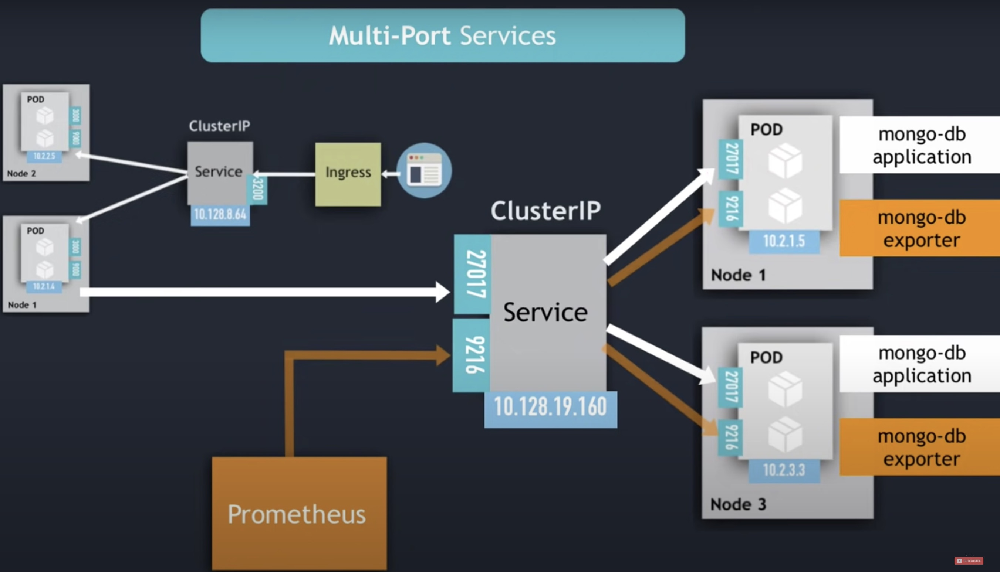
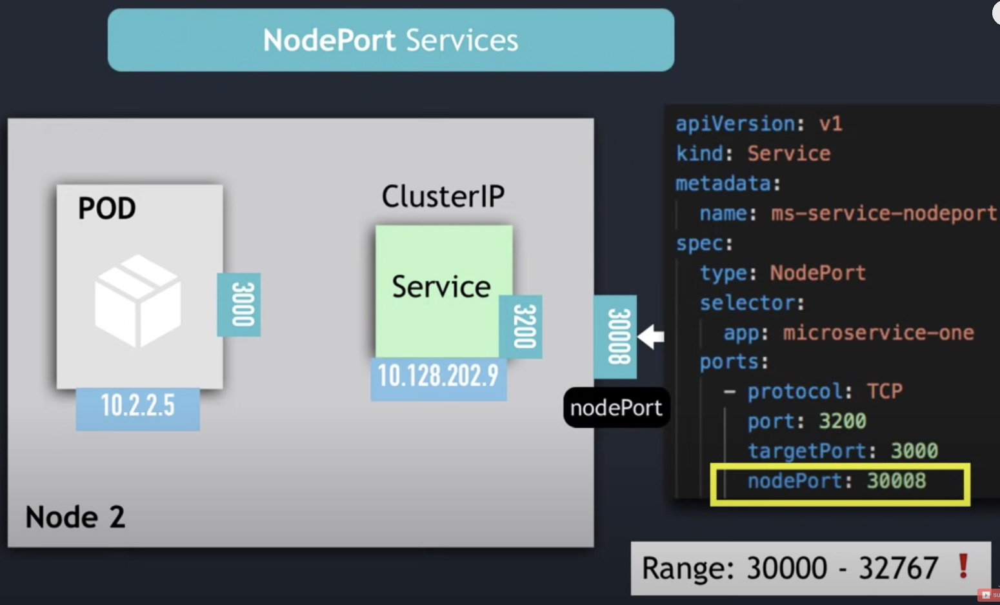
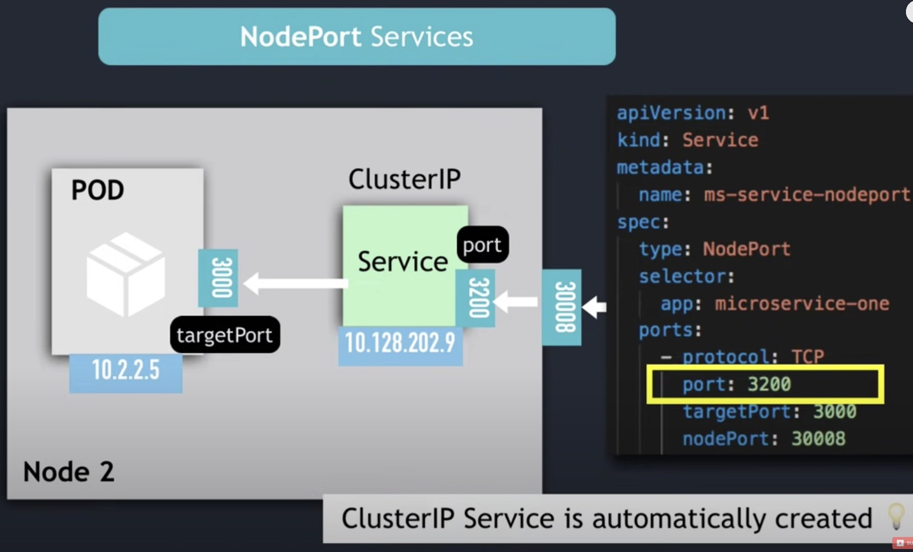
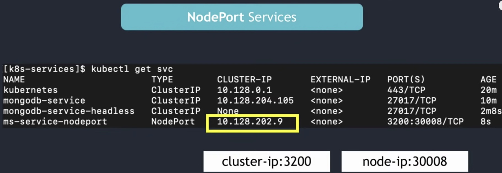
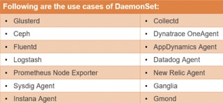
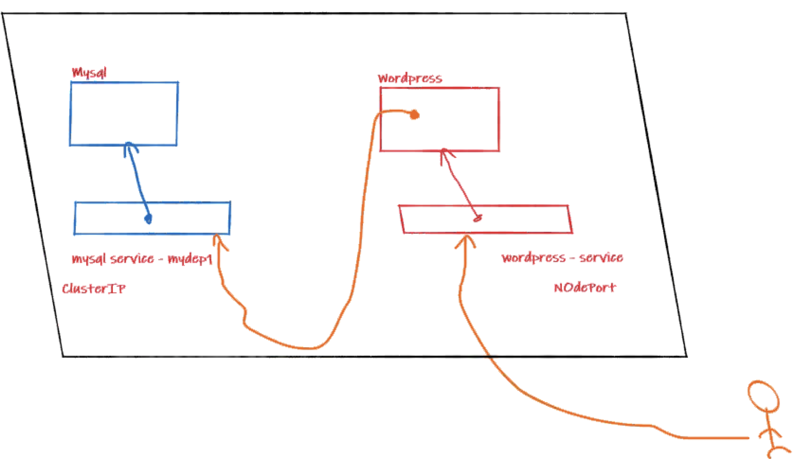

# My notes on kubernetes objects

### 1 INTRODUCTION
    1. svc-apache2.yml creates a service which selects from apache1.yml pod and apache2.yml pod and exposes the same service ip:port, so randomly one application is rendered on the webpage. 
    2. The difference between apache1.yml and apache2 is:
        - apache1.yml : Renders the default "it works!" webpage from httpd:alpine image
        - apache2.yml : Renders an index.html mounted from a local drive. 
    3. steps 
        - kubectl create -f apache1.yml
        - kubectl create -f apache2.yml
        - kubectl create -f svc-apache2.yml
        - kubectl describe scv svc-apache2 : this gives endpoints matching ip add of both the pods which it is selecting.
        - curl http://localhost:{port to which svc is exposed}
        - kubectl exec --namespace brk pod/po1 -- wget --spider -q -S http://10.1.0.27:80 to exec into a running pod and see server resonce.

### 2 : SERVICE
    Types of service:
    - ClusterIP : 
        1. Creates a service which gets an IP and port but is accessible only via from inside the cluster, using *service IP and port.* Target port inside the manifest for service is port of pod to to which the service connects.
        2. Since this is accessible only from inside the cluster an ingress controller is added, clients talk to ingress controller which then connects via Cluster IP. 
    
        We can create multiport services i.e. service which exposes multiple ports 

    - NodePort : 
    
        1. Creates a service with IP and port which can be reached via any of the nodes from outside cluster by using *node's IP address and port of the service.* The etcd server knows how to redirect the traffic from node to service and from service to hit the pod. 
        
        2. Creating a nodeport creates a clusterIP automatically, the port mentioned on maifest is the port of IPcluster created and target pod mentioned is the port of the pod. 
        
        3. This is not very secure as we are exposing each node directly to clients outside the cluster.

        4. Once a svc is created as Cluster IP we can do `kubectl edit scv svc-name` and edit the type to NodePort (cap N and P) to change the service from Cluster IP to NodePort.
        
    - LoadBalancer : uses external load balancer 
    
        1. external load balancer deploys NodePort and ClusterIP automatically.
        2. Can be corp loadbalancer or by a cloud provider.
        3. Entry point becomes the loadbalancer. Node port created is only accessible by the loadbalancer.

### 3 : DEPLOYMENTS
    1. Deployment creates a pod and a replicaset by itself without explicit definitions of pod or replicaset.
        - kubectl create deployment dep1 --image=httpd:alpine -n brk
            - Above will create a replicaset and a pod.
        - as of now there are no ports which are exposed so cannot reach this app. To expose the port do below, this creates a service exposed at port specified as ClusterIP by default. Exposing creates a service.
            - kubectl expose deployment dep1 --port=80 -n brk
            - Access the application from inside a pod since this is a ClusterIP by reaching to service IP & port from inside a pod, by : 
                - kubectl exec -n brk dep1-54568b4b49-hcmn8 -- wget --spider -q -S http://10.111.218.181:80
        - if we want to see loadbalancing hapen do these:
            - Exec into a container: kubectl exec --namespace brk -it dep1-54568b4b49-hcmn8 sh
            - change the index.html
            - hit the service from within a pod and see random selection of pods.
        - if we delete the pod, the deployment would recreate the pod.
            kubectl delete pod dep1-54568b4b49-xqwq4 -n brk : Deltes the pod.
            kubectl get all -o wide -n brk : you will see another pod gets created with a new name.
        - Deployment first creates a replicaset and replicaset matches the no of pods to target number.
        - Scaling the deployment: 
            - kubectl scale deployment dep1 --replicas=5 -n brk
            - we can scale the deployment backwards also.
        - kubectl get replicaset -o wide -n brk to get replicasets in a namespace.
        - Deleteing a deployment deletes the pods, replicaset and deployment, but not the services !!

### 4: Replicaset
    1. Create replicaset by deploying the rc.yml
        - kubectl create -f rc.yml -n brk
    2. We see the RS creates all the pods by itself. But does not create any service like deployments do.
        - kubectl get all -o wide -n brk
    3. Deleting RC deletes the Pods as well.

### 5: Selectors
    1: Create pod1 to pod6 using create -f command like : 
        - kubectl create -n brk -f pod6.yml
    2: List all pods with labels : 
        - kubectl get pods -n brk --show-labels
    3: Equity based selectors:
        Filter pods with : 
            - kubectl get pods -n brk -l color=blue --show-labels
    4: Set based selectors:
        Filter pods with : 
            - kubectl get pod -n brk -l 'color in (blue)'
            - kubectl get pod -n brk -l 'color in (blue,red)' --show-labels
            - kubectl get pod -n brk -l 'color notin (blue,red)' --show-labels

### 6: Resources and limits
    1. Deploy the resource.yml
        - kubectl create -f resource.yml -n brk
    2. Describe the pod to see Limits and Requests
        - kubectl describe pod resource-example -n brk
    3. Take NODE value from kubectl get pods and describe the node 
        - kubectl describe node docker-desktop -n brk
        - this gives if there is enough memory and memory left, the CPU and memory Requests and limits for the pod.
    4. CPU UNITS :
        - 1 CPU in k8's = 1 Azure vCore / 1 GCP core / 1 AWS vCPU / 1 Hyperthread on baremetal intel processor
        - ex: 0.5 CPU = 500m CPU / 500 milli CPU
        - ex: 0.1 CPU = 100m CPU / 100 milli CPU

### 7: DaemonSets
    1. DaemonSets ensure numeber of pods is same as no of nodes i.e. one pod per node, even in there are new joined nodes, the demonset will replicate the pod over the new joined node. Every node will run just 1 pod, no less no more. 
    2. Usually run for node monitoring, node log collection, storage cluster etc. 
    3. Create DaemonSet by using
        - kubectl apply -f daemonset.yml -n brk
    4. Check DaemonSets by using 
        - kubectl get daemonset -o wide -n brk ,or
        - kubectl get ds -o wide -n brk 
    5. Check the pods and check pod logs to see if everything is working
        - kubectl logs daemonset-example-6sl8k -n brk
    6. Delete the pod and see the pod spawn again.
    7. Delete the DS & pods created by DS are deleted as well.
        - kubectl delete ds daemonset-example -n brk
    8. 

### 8: Making apps schedulable on Master node
    1. kubectl get node -o wide
    2. kubectl edit node {server/master}
    3. on vi editor remove the taint and effect
    4. Now master has become schedulable * but this is not adviced.*

### 9: Environment Variables
    1. Run mysql as a deployment, this dry-run with -o gives a yaml output and saves it to output.yaml which can be used as template for further deployments.
        - kubectl create deployment mydep1 --image=docker.io/mysql:5.6 --dry-run=client -o yaml > output.yaml
        - kubectl create -f output.yaml -n brk
    2. Above will fail, lets diagnose by first running the docker image of mysql and then traslating the docker command to .yml file.
        - <docker commands.>
    3. Observations and changes to output.yaml
    4. Deploy the services. 

### 10: Deploy a 2 tier application, wordpress powered by mysql. 

    ### MySQL Deployment + service 

    1. Deploy mysql image using docker. 
        - docker run --name brk-sql -p 3306:3306 -d -e MYSQL_ROOT_PASSWORD=root -e MYSQL_DATABASE=brk_db -e MYSQL_USER=admin -e MYSQL_PASSWORD=root mysql:latest
        - access by docker exec -it brk-sql /bin/bash ; mysql -u root -p ; 
    2. Test connection with mysql-workbench, connect it to 127.0.0.0 port 3306 and create tables and check tables from exec into container. 
    3. use mysql.yml to deploy the same thing on k8
        - kubectl create -f mysql.yml -n brk
        - kubectl exec -n brk -it brk-sql-5457fdc548-h4ltx bash
        - mysql -proot -uroot
    4. Expose the deployment 
        - kubectl expose deployment brk-sql --port=3306 -n brk
    5. Edit the service to NodePort
        - kubectl edit svc brk-sql -n brk
    6. Connect to localhost:port or connect to 192.168.1.13 (ifconfig) and port via mysql-workbench

    ## WordPress application & service.
    1. Deploy wordpress 
        - kubectl create -f wordpress.yml -n brk
    2. expose the deployment directly as NodePort
        - kubectl expose deployment brk-wp -n brk --port=80 --type=NodePort 
    3. Get Ip address of any node and connect via brower using node IP & port of service
        - kubectl get node -o wide

### 11: Namespaces
    1. All system pods are run on a different namespace to prevent users from interacting with them
        - kubectl get pod -n kube-system
    2. Listing all namespaces
        - kubectl get namespaces
    3. Create namespace
        - kubectl create namespace example-namespace

### 12: Node Selector & Node Labels
    1. Show labels on nodes
        - kubectl get nodes --show-labels
    2. Tag nodes to labels ( label is just a key value pair.)
        - kubectl label node {nodename} key1=value1
    3. To select a node on which POD should be run 
        a. Add labels to nodes.
        b. Add nodeSelector & key value label of node to the spec >> Container of the .yaml for the pod resource. 
    4. Remove a label from a node
        - kubectl label node {nodename} key- (key and minus sign)

### 13: Metrics-Server
    1. We must have metric server for pods to autoscale.
    2. Download the metric server from github. 
        - kubectl apply -f https://github.com/kubernetes-sigs/metrics-server/releases/latest/download/components.yaml 
    3. Check if metric server is deployed but you will notice it has not started. 
        - kubectl get pod -n kube-system 
    4. We have to apply a patch to this deployment for it to work.
        - wget -c https://gist.githubusercontent.com/initcron/1a2bd25353e1faa22a0ad41ad1c01b62/raw/008e23f9fbf4d7e2cf79df1dd008de2f1db62a10/k8s-metrics-server.patch.yaml
        - if wget is not available try this :
        - curl  https://gist.githubusercontent.com/initcron/1a2bd25353e1faa22a0ad41ad1c01b62/raw/008e23f9fbf4d7e2cf79df1dd008de2f1db62a10/k8s-metrics-server.patch.yaml -o k8s-metrics-server.patch.yaml
    5. Path the metric-server deployment with the path.yaml file.
        - kubectl patch deploy metrics-server -p "$(cat k8s-metrics-server.patch.yaml)" -n kube-system
    6. Now the metrics-server should be up and running. 
        - kubectl get pod -n kube-system  
    7. Metric server enables kubectl top command
        - kubectl top nodes 
        - kubectl top pod -n brk
        - kubectl top pod -n kube-system      

### 14: HPA Horizontal Pod Auto-scaling.
    1. Scales the no of pods up and down based on the load on the pod. 
    2. To test this lets create a deployment and a service to expose the deployment 
        - kubectl create -f php-apache.yaml 
        - kubectl get all -o wide -n brk
    3. Apply the horizontal pod scaling yaml
        - kubectl create -f hpa-example.yaml 
    4. To create a virtual load, run a busy box to hit the api of php-apache service.
        - Deploy busy box
            - kubectl run -i --tty load-generator --image=busybox /bin/sh -n brk
        - Hit the API contineously.
            - while true; do wget -q -O- http://php-apache.brk.svc.cluster.local; done
        - Observe the number of pods by adding a watch
            - kubectl get pod -w 
        - watch the pods scale now on loads , add multiple loaders if you want.
        - To see horizontal pod autscalers in a namespace 
            - kubectl get hpa -n brk
        - We can delete everything defined in a .yaml file in same way as we create, this is better way of deleting stuff.
            - kubectl delete -f hpa-example.yaml
            - kubectl delete -f https://github.com/kubernetes-sigs/metrics-server/releases/latest/download/components.yaml 
            - Above deltes all bindings and metrics server along with everything it created.
        
### 15: LOGS
    1. By specifying the name of the pod.
        - kubectl logs {podname} -n {namespace}
    2. By specifying the name we can check logs of multiple pods. We see lot of pods with replicaset
        - kubectl logs -l selector{kv pair}
    3. Logs for last x time
        - kubectl logs -l selector{kv pair} --since=1h 
        - kubectl logs -l selector{kv pair} --since=10m
    4. Last x lines of logs    
        - kubectl logs etcd-docker-desktop  -n kube-system --tail=2
    5. Watch the logs live add -f
        - kubectl logs etcd-docker-desktop  -n kube-system --tail=2 -f

### 16: Rolling updates
    1. kubectl create -f ghost.yml 
    2. kubectl get deployment
    3. kubectl get pods
    4. kubectl describe deployment mydep
    5. kubectl rollout --help
    6. kubectl rollout history deployment mydep
    7. kubectl set image deployment mydep mydep=ghost:0.11 --record
    8. kubectl rollout history deployment mydep
    9. kubectl describe deployment mydep
    10. kubectl set image deployment mydep mydep=ghost:0.9 --record
    11. kubectl rollout history deployment mydep
    12. kubectl describe deployment mydep
    13. kubectl rollout history deployment mydep
    14. kubectl rollout undo deployment mydep --to-revision=3
    15. kubectl rollout history deployment mydep
    16. kubectl rollout pause deployment mydep
    17. kubectl get pod
    18. kubectl set image deployment mydep mydep=ghost:0.14
    19. kubectl get pod
    20. kubectl rollout history deployment mydep
    21. kubectl rollout resume deployment mydep
    22. kubectl rollout history deployment mydep
    23. kubectl get pod

### 17: Container Args
    1. Run the pod
        - kubectl create -f podcommand.yaml
    2. See the entry point provided as command 
        - This is not run on shell but this is the command which container runs, the container exits after running this. 
        - Args give the arguments with entry point. 
        - If the container does not run anything , the pod enters a crashback loop or completed state and stops. 
        - Pods life is determined by what we write in these. 

### 18: Evinronment Variables & ConfigMaps
    1. Conig maps are a way to pass environment variables to the application. 
    2. We create a config map wich is key value pairs aka environment variables.
    3. Env variables can be directly written in yaml file, the reason we need config maps is - Common env variables for multiple pods. Config maps can be shared with multiple pods or deployments. 
    4. There are three ways of using config maps.

        1. Creating the config map as literal and Entire config map is mapped as env variables in a pod.

            - Check the existing configmaps
                - kubectl get configmaps
            - Describe the configmap
                - kubect describe configmap {name} -n {namespace}
            - Create a configmap from literals
                - kubectl create configmap example-configmap -n brk --from-literal=developer=bharath --from-literal=environment=production 
            
            Lets deploy a sql image with env variables read from a config map.
                1. kubectl create configmap sql-cm -n brk --from-literal=MYSQL_ROOT_PASSWORD=root --from-literal=MYSQL_DATABASE=brk_db
                2. kubectl create -f mysql_with_cm.yaml 
                3. kubectl expose deployment brk-sql --port=3306 -n brk

            
        2. Pod selects a few env values from the config map.

            1. Create configmap from literal 
                - kubectl create configmap example-config -n brk --from-literal=key1=value1 --from-literal=key2=value2
            2. Describe the configmap
                - kubectl get configmap -n brk
                - kubectl describe configmap example-config -n brk
            3. Deploy a pod, select only value2 from the configmap
                - kubectl create -f httpd_cmselection.yaml
            4. Exec into the pod and check the env variable
                - kubectl exec -n brk po1 -i -t -- /bin/sh
                - in terminal inside the pod : echo $containerKey # this is what we selected in .yaml definition file.
            
        3. Attaching the config map as an external volume mount to the pod.

            1. Create a configmap from literal
                - kubectl create configmap example-config -n brk --from-literal=key1=value1 --from-literal=key2=value2
            2. create a definition file pod_cm_as_vol.yaml and deploy it
                - kubectl create -f pod_cm_as_vol.yaml -n brk
            3. Exec into the pod 
                - kubectl exec -n brk po1 -i -t -- /bin/sh
            4. Get the values by changing into mount path
                - cat /tmp/myenvs/key1
                - cat /tmp/myenv/key2

### 19: Secrets
    1.  check secrets 
        - kubectl get secret -n brk
    2. create secret from literal, we are creating a generic type of secret.
        - kubectl create secret generic sql-secret --from-literal=mypass=root -n brk
    3. Describe the secret, it will display only the key but no value i.e. it will show mypass but not show the value of "root"
    4. Create the definition file with env variables taken from the secret. Deploy it
        - kubectl create -f mysql_secrets.yaml -n brk
        - kubectl expose deployment brk-sql --port=3306 -n brk
    5. edit the service to NodePort
        - kubectl edit service brk-sql -n brk 
    6. Change the CLusterIP to Nodeport and delete the cluster IP lines
    7. Use ifconfig to get local IP and kubectl get all -o wide -n brk -> to get port exposed and connect via sql-workbench.

### 20. BACKUP of cluster
    1. Generate a definition file from a deployment
        - kubectl get deployment {dep name} -o yaml > definition.yaml

### 21. Init containers.
    
    Example 1

    1. If a container needs some initialization we can use inti containers. 
    2. In the example init-nginx.yaml we define a simple nginx server. 
    3. We define a volume called webpage which is an empty directory
    4. Mount the webpage volume to the mount path of nginx service directory : /usr/share/nginx/html
    5. Define initcontainer - in our case busybox
    6. Busy box initializes first and executes a wget command to download an html file to the volume 
    7. We define a volume mount for busy box and use same volume - webpage.
    8. Expose the service and see if the webpage is served by the nginx application.

    Example 2
    An init container downloads a git hub repo to a volume, this same volume is mounted to nginx serving directory
    1. NGINX webserver definition
        - define a volume whith mount point as html serving path /usr/share/nginx/html
        - define init container
    2. INIT container
        - use same volume for bitnami/git rep point to any random directory. 
        - use command to git clone a repo into this random directory.
    3. Define the volume
        - name the volume , use same name used in Nginx and init container volume.
        - an emptydir type of vol is live only till life of pod but this prevents any data from being downloaded to local machines.
    4. Expose the pod using a service of NodePort type.
    5. Use localhost with port to see the webpage being served.

 ### 22. Healthchecks with Readiness and liveness probes
    1. By default K8 would start sending traffic to a pod when all containers in the pod start. Start does not mean they are ready. Containers start when processes in containers start running - does not mean container is fully ready to serve traffic. 
    2. There are three types of health checks
        1. Readines Probes: 
            - are designed to let k8 know when the app is ready to serve the traffic. K8 ensure these probes are passed before sending the traffic to the pods.
            - ex if container starts but is still starting, or during scaleup new copies shoudl not receive traffic until copies are fully read. If not then remove the pod from the loadbalancer. This is more at a pod level.
        2. Liveness probes: lets K8 know if an app is alive or dead. If its alive K8 doesnt do anything but if its dead, K8 will kill the container and restart it. A liveness probles failure will cause the container to restart. This is at container level. 
        3. Startup probes: Has the container application started? If no then keep the liveness and readiness probes disabled. This is at application level.
    3. Types of probes available for liveness and Readiness checks
        - HTTP Probes : Install a light weight http server to respond to a liveness probe. K8 will ping a path and if HTTP responce is 200 or in 300 range the container would be marked as healthy.
        - Command : K8 will run a command inside your container, if command returns with exit code 0 then container is marked healthy. Used when we dont want to run a HTTP server but we can run a command to check if app is healthy or not.
        - TCP : K8 will try establish a TCP connection on a specified port, if connection is established then container is deemed healthy.
    4. Probes can be configured in many ways. 
        - initialDelaySeconds: Since failure of liveness probe causes a container to restart, these probes should be started only when contianer is fully up and not as soon as processes inside container starts. Recommendation is p99 of app startup time.
        - periodSeconds : Frequency of checks.
        - timeoutSeconds
        - successThreshold
        - failureThreshold : Max time the startup probe will wait for application to start before failing. On failing the container is killed and is subject to pod's restart policy.

    5. LIVENESS PROBE EXAMPLE
        1. Create a manifest by dry run and redirect it to a file
            - kubectl create deploy livenessprobe --image busybox -o yaml --dry-run > livenessprobe.yaml
        2. Ammend the mainfest file, to get container to create a file , sleep for 20 sec & delete the file and sleep for 10 mins, deploy a liveness probe. We are using command probe to cat the file created, only if this command returns an exit status 0 is when the container is considered healthy, Add intial delay of 5 seconds, to prevent immediate liveness checks and a poll period of 3 seconds.
        3. Deploy the manifest.
        4. We see the restarts as 0 if we see all pods
        5. see the events 
            - kubectl get events -n brk
        6. we see events, liveness probe failing and restring the pod, we can see this on no. of restarts on 
            - kubectl get all -n brk

    6. READINESS PROBE EXAMPLE
        1. We will deploy a container to sleep for 20 sec before creating a file and then sleeping again, the readiness probe starts after 15 seconds.
        2. check the events, we see the readiness probe failing at 15 secs and then 
            - kubectl get events -n brk
        
### 23. STATEFULSETS
    1. While stateless components are deployed using DEPLOYMENTS, stateful applications are deployed using STATEFULSET in k8.
    2. Just like deployment, statefulset also allows replication pods i.e. both manage pods based on identical container specification.
    3. Both Deplyment and Statefulset cofigure storage the same way.
    4. The service creates a hash to direct traffic to a pod , in stateless apps - this works fine. For Stateful set, each pod gets a unique persistent identifier across any rescheduling i.e. if a pod dies the new replcaement pod gets the same identity as the dead pod. The storage of the pod has state of the pod saved. This is how new pods know of storage attachments.
    5. For statefulsets like database, we would need a master for read write and slaves for read onlys to maintain data consistency. These slaves have their own storage and do not share a storage. For data to be consistent these storages must be synchronized. There is a mechaism for all slaves to be in sych with master to maintain data consistency. 
    6. For deployment each pod gets a random hash as a name, for stateful set these are serial numbers starting form 0. 
    7. Each pod in statefulset get 2 pod endpoints. 
        - load balance service ( this is just like deployment )
        - individual dns name for each pod ${pod name}.{governing service domain} this ensures that when pod restarts the IP address changes but the name and endpoint stays the same. Sticky indentity !! this is necissary for data consistency.
    8. Stateful applications are not perfect candidates for containerized environments. 

### 24. INGRESS CONTROLLER

### 25. Data persistance on Kubernetes
    1. Persistent volume is a cluster resource created by a YAML file. This is just an abstract component it must take storage from pjysical storage from cluster hard drive or nfs drive or cloud. 
    2. We define which storage backend to use in spec of the PersistentVolume manifest.
    3. PV are not namespaced and are accessible by entire cluster. 
    4. While PV is created and provisioned with cluster, each application has to make a claim to this storage on app manifest. PVC should be in same namespace as the application. PV is claimed by pod via PVC , this causes the storage to be mounted to the pod and this same storage is then mounted to the container. So volumes should be specified both on pod and container. 
    5. STORAGE CLASS provisions a PV dynamically when a PVC claims it. These are also created using manifest files (YAML).  of kind SotrageClass. 
    6. Reclaim policy
        - Retain : All data is retained when pod craches, unless admin of cluster deletes the data.
        - Recycle : DEPRECATED
        - Delete : Data is deleted when PCV and pod is deleted.
    7. Access Modes
        - RWO Read Write Once, only one node can write and rest of nodes can read in a multinode cluster.
        - RWM All nodes can read and write.
        - RO  Pods can only read from this PV.
    8. See the existing PV by using below command , note that PV is not bound by any namespace and hence not required.
        - kubectl get pv
    9. Create a PVC manifest. The storageClassName should match the storage class as mentioned in kubectl get PV.
    10. See the existing PVC by 
        - kubectl get pvc -n brk
    11. Inside the pod manifest under spec > volumes , define pvc with name matching pvc created, under the container volume mounts speficify the name as pvc name and mount directory in mountpath. 

### 26. Kubernetes Operators.
    1. Mainly used for stateful applications. 
